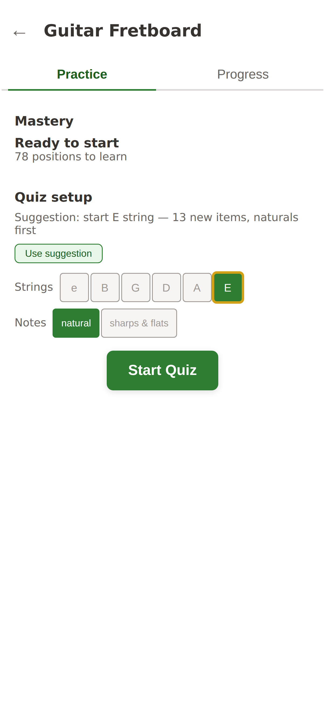
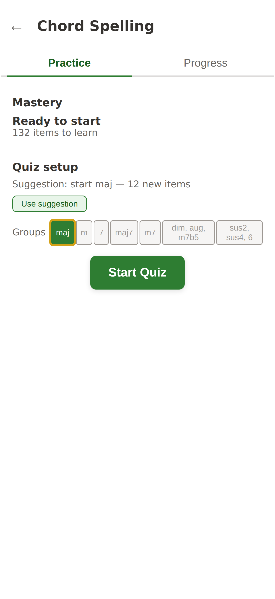
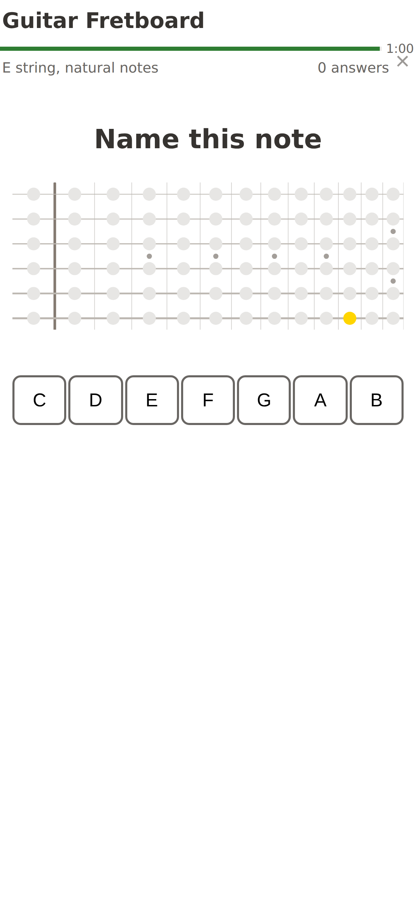

# Intro

The quiz mode works, but feels very sloppy. Let's clean it up. Goals:

- Effortless to use — every interaction is obvious; nothing requires explanation or experimentation.
- Logically structured — layout, grouping, and hierarchy match how users think about the task.
- Visually polished — cohesive, warm, and refined enough that the app feels like a finished product, not a prototype.

# Current state

## Flows

Six phases, managed by the engine state machine (`quiz-engine-state.js`):

```
         ┌──────────────────────────────────────────────────┐
         │                                                  │
         ▼                                                  │
  ┌─────────────┐   no baseline   ┌───────────────────┐    │
  │    idle      │ ──────────────► │ calibration-intro  │    │
  │ (Practice /  │                 │ "Quick Speed Check"│    │
  │  Progress)   │                 └────────┬──────────┘    │
  └──────┬───────┘                          │ Start         │
         │ Start Quiz                       ▼               │
         │                         ┌────────────────┐       │
         │                         │  calibrating   │       │
         │                         │  (10 trials)   │       │
         │                         └────────┬───────┘       │
         │                                  │               │
         │                                  ▼               │
         │                         ┌──────────────────┐     │
         │                         │ calibration-     │     │
         │                         │ results          │     │
         │                         │ (baseline table) │     │
         │                         └────────┬─────────┘     │
         │                                  │ Done          │
         │                                  │               │
         ▼                                  │               │
  ┌─────────────┐                           │               │
  │   active     │ ◄────────────────────────┘               │
  │  (quizzing)  │                                          │
  │  60s rounds  │                                          │
  └──────┬───────┘                                          │
         │ timer expires                                    │
         ▼                                                  │
  ┌────────────────┐   Keep Going                           │
  │ round-complete │ ──────────► active (next round)        │
  │ (stats summary)│                                        │
  └──────┬─────────┘                                        │
         │ Stop / Escape                                    │
         └──────────────────────────────────────────────────┘
```

Within the **active** phase, there's a micro-loop:

1. Question presented (prompt + answer buttons enabled)
2. User answers → feedback shown (correct/incorrect + correct answer)
3. Auto-advance after 1s, or tap/Space to advance immediately
4. Next question (or round-complete if timer expired)

**Escape** stops from any non-idle phase. The × button in the session info row
also stops.

## IA

All 11 quiz modes share the same screen scaffold. Three regions swap
in and out as the phase changes.

### idle — Practice tab (default)

```
← (back)  |  Mode Title

[Practice]  [Progress]

Practice card
  Status summary            "Overall: Solid" / "12 of 78 items fluent"
  Recommendation            "Recommended: G, D strings" + [Use recommendation]
  Scope toggles             (mode-specific)
    - Fretboard modes: string toggles + "Natural only" checkbox
    - Group modes: distance/group toggles
    - Simple modes: nothing
  Session summary           "48 items · 60s"
  Mastery message           "Looks like you've got this!"
  [Start Quiz]

Advanced (collapsed)
  [Redo speed check]
```

  

### idle — Progress tab

```
← (back)  |  Mode Title

[Practice]  [Progress]

(optional: fretboard with heatmap overlay)
Heatmap grid / table
[Recall] [Speed] toggle
Aggregate stats text
```

### active (quizzing)

```
Countdown bar               depleting over 60s, turns red in last 10s
Context | Time | Count | ×

Progress bar                "5 / 78 fluent"

Question prompt             text or fretboard highlight
Answer buttons              mode-specific: notes, numbers, intervals, etc.
Feedback                    "Correct!" or "Incorrect — C#"
Hint                        "Tap anywhere or press Space for next"
```

Back button, title, tabs, and practice card are all hidden.

  

### round-complete

```
Countdown bar (expired)
Context | Time | Count | ×

Progress bar                "5 / 78 fluent"

"Round 1 complete"
┌──────────┬──────────┬──────────┐
│  8 / 9   │  1.2s    │  5 / 78  │
│ correct  │ median   │  fluent  │
└──────────┴──────────┴──────────┘
[Keep Going]  [Stop]
```


### calibration

Same quiz region, three sub-screens:
- **Intro**: heading "Quick Speed Check" + explanation + [Start]. Answer buttons hidden.
- **Trials**: prompt text + answer buttons. Progress shows trial count ("3 / 10").
- **Results**: baseline time + threshold table + [Done].

## Visual

Reference: [moments.html](../../docs/design/moments.html) has build-generated
402px mockups of all key states. The moments currently rendered:

| Moment | Phase | What it shows |
|--------|-------|---------------|
| Fretboard — awaiting answer | active | Highlighted note circle, naturals only |
| Semitone Math — correct | active | Green feedback, time display, hint text |
| Interval Math — wrong | active | Red feedback, wrong answer shown |
| Chord Spelling — mid-answer | active | Chord slots (correct/active/empty) + note buttons |
| Round complete — good | round-complete | 89% correct, fast median |
| Round complete — rough | round-complete | 56% correct, slow median |
| Practice tab — consolidating | idle | Status "consolidating", recommended toggle glow |
| Practice tab — ready to expand | idle | Mastery message visible, ready to expand |
| Home screen | — | Group labels + mode buttons + footer |
| Progress tab — recall heatmap | idle | Heatmap + legend + stats toggle |
| Countdown bar — fill levels | active | Brand fill → red warning states |

Screenshots (402px @ 3x) live in `screenshots/`. Full set: idle + quiz for all
10 modes, plus round-complete. Key ones are inlined in the IA section above.

# Problems

## Flow

1. **Speed check derails the "start practicing" intent.** First visit: user
   taps into a mode wanting to drill → gets a "Quick Speed Check" they didn't
   ask for → 10 trials → results table → Done → *back to idle*, where they
   still have to press Start Quiz. The speed check flow hijacks the intent
   without explaining why it matters or letting the user skip it.
    
    **Recommendation**: Speed check isn't needed for quizzing. It's needed for accurate progress evaluation. Move it to the progress tab for now: start with defaults, show a prompt to do a speed check to be more accurate. Could also show same prompts on home page, but leave that for later.


2. **Phase transitions are instant.** Every state change (idle → active →
   round-complete → idle) is a hard cut — elements blink in and out. Feels
   mechanical, not designed.

   → Per *Screen states are distinct designs* ("State transitions should
   feel intentional — a visible layout change, not subtle element
   flickering"): Add 100–150ms fade for phase transitions. Respect
   `prefers-reduced-motion`.

4. **Round-complete "soft ending" is awkward**. When the timer expires, we wait for the user to answer, but don't signal
   this in any way. Either stop the clock and show the answer or add a "Waiting for answer to last question" state.

   → Per *State should explain itself* + *Label everything*: the
   "timer expired, waiting for final answer" state is invisible — the
   user doesn't know why things paused. Freeze the countdown bar at
   0:00 and show a subtle "last question" label in the session info
   row. Keep the question answerable, then transition to round-complete.

5. **No way to pause.** Once a round starts, the 60s timer is unstoppable.
   The only options are to keep answering or stop entirely (losing round
   progress). Getting interrupted means wasting the round.

   → Per *Short-session friendly* + *Minimal friction*: interruptions
   are a real part of short-session use. Low priority — could add a
   pause button that freezes the timer, but adds interaction complexity.
   Leave for now.

## IA

### Content problems

5. **Context label is cryptic.** During quiz, the session info shows things
   like "±1,2" or "E string" or "maj". These are the scope filter labels, but
   they read as jargon. "±1,2" means the user selected distance groups 1 and
   2, but nothing explains that.

   → Per *Label everything*: add a one-line summary of what we're practicing.
    "Practicing note recognition on e,B strings", "Practicing semitone addition and subtraction: ±1–2 semitones."


6. **Group toggle labels are opaque.** Numbers like "1,2", "3,4", "9,10" or
   "0-1", "2", "3" don't tell the user what items they're selecting. The
   fretboard mode has clear labels ("e B G D A E") but group modes give no
   hint what's inside each group.

   → Per *Label everything* + *Visualize, don't decode*: 
    - label the group selection section of the page: 
        "Select strings to practice.
        Suggestion: 
            solidify E string  (justify the suggestion)
            start on A string
            (Use suggested button)

            e B G D E A  (otherwise stick with that user used last)"

7. **"Advanced" section is vestigial.** A collapsed `<details>` containing a
   single button ("Redo speed check") that most users will never need. It
   takes up space and raises questions: "Advanced what? What else is in here?"

   → Per *One screen = one primary intention*: as in #1 above. Remove the advanced section, move "Do/Redo speed check" to the Progress tab.

8. **Recommendation text is absent on fresh start.** When there's no practice
   history, the recommendation area just collapses to nothing. No guidance for
   new users about where to begin.

   → Per *State should explain itself* + *Action gravity*: pick a default suggestion for new users. The recommendation
   area should never be empty. e.g. "Suggestion: start with E string".

9. **Countdown bar and time display are redundant.** The depleting bar shows
   time remaining visually, and the text ("1:00", "0:42") shows it
   numerically. Both are always visible. Two representations of the same data.

   → Per *One way to do each thing*: keep the visual bar (glanceable) and
   the numeric display (precise). If user doesn't know how long the bar was, it's less helpful. Could show round length, but countdown seems more useful. Keep both. Connect them visually so it's clear they're showing the same thing.
   
10. **Progress bar label is ambiguous.** "0 / 48 fluent" during a quiz — is
    that this round or all-time? It's all-time, but the context (mid-quiz)
    suggests it might be the round.

    → Remove from active quizzing mode. Not necessary there at all.
    → On round complete screen: need IA cleanup:
        - Keep context on mode
            - "Practicing note recognition on e, B strings"
            - Estimated "fluency" display

        - "Round complete". Round details:
            - 5/9 correct in 63 seconds (include "waiting for final answer time")
            - 2.8s median response time
            - <any other round stats will go here>

        - Actions: Keep going / Stop
    

### Hierarchy problems

11. **Practice card is an undifferentiated box.** Status, recommendation, scope
    toggles, session summary, mastery message, and Start CTA are all in one
    flat gray card with no internal structure. Nothing separates "how am I
    doing" from "what should I practice" from "go".

    → Per *Group related controls* + *Visual containers match logical
    groups*: add internal dividers or spacing zones within the card.
    Three zones: status/recommendation (context) → scope toggles
    (configuration) → session summary + Start (action). Subtle
    `border-bottom` or increased gap between zones.

12. **Huge empty space below the fold.** Every idle screenshot shows the
    practice card occupying the top ~40% and then nothing. The bottom 60% is
    blank. Same in quiz mode — answer buttons sit mid-screen with emptiness
    below.

    → Per *Spatial rhythm*: vertically center quiz content in the
    available space. 
    - For idle, first fix IA, then reeval vertical space.
    

13. **Quiz prompt competes with the fretboard.** In fretboard mode, the
    question is a tiny yellow dot on a large gray diagram. The fretboard
    dominates visually but the dot is the only thing that matters. No text
    prompt reinforces what the user is supposed to do.

    → Per *Content hierarchy follows interaction priority* (question is
    #1 priority): 
        - add a text prompt above or below the fretboard
    ("What note is this?") 
        - enlarge the highlight circle to draw the eye. The dot should be the most visually prominent element.
            - yellow may be a bad color choice -- perhaps a darker color?
            - or making it bigger might be enough.

14. **Round-complete stats float in space.** Three numbers centered on an
    empty screen. No card, no background treatment, no visual weight. Feels
    like a placeholder.

    → First, fix IA as discussed above.
    → Then, per *Visual containers match logical groups* + *Spatial rhythm*:
    wrap stats in a card with background treatment. Center vertically in
    the available space. Give the heading and stats more visual weight.

15. **Button layout in interval and note drilling is unhelpful**. Just a grid of 12 notes. Should use piano layout instead, as with notes.

    → Per *One interaction grammar* + *Visualize, don't decode*: answer
    buttons for note names should use a consistent spatial layout that
    leverages existing mental models. Reuse the piano-style two-row
    layout (naturals + accidentals) for all modes that answer with note
    names. Already proven in fretboard mode.
    → Use the same pattern for intervals too -- reinforces the mental model, map to semitones.

## Visual

### Color and surface

16. **Everything is white or light gray.** Buttons, cards, background — the
    palette collapses to `#fff` and `hsl(30, 10%, 96%)` for 95% of the screen.
    The sage brand color only appears on the Start Quiz button and active
    toggles. During quiz, there's almost no color at all.

    → Per *Warmth over sterility*: add subtle warm tint to button
    backgrounds (cream instead of white). Use sage accents on active
    elements beyond just the CTA. Consider a very subtle background
    gradient or surface depth during quiz.
        - use interactive process like in the fretboard redesign (in PR 77) to explore visual directions.

17. **Answer buttons look like form inputs.** White background, thin gray
    border, no depth. Nothing signals "tap me" — they read as text fields, not
    interactive targets.

    → Per *One interaction grammar* (buttons must be visually distinct
    from non-interactive elements) + *Warmth over sterility*: Add soft
    shadow or inset effect to make buttons feel pressable/tactile.
    Slightly rounded, warmer background, stronger border. The
    accidental-note buttons (already tinted) hint at the right direction.
       -> ditto on fast interactive exploration of options.

18. **Feedback is just colored text.** Correct/incorrect feedback is a line of
    green or red text below the buttons. No background flash, no button
    highlighting, no visual moment. The most emotionally significant event in
    the loop gets the least visual treatment.

    → Per *Feedback clarity*: highlight the correct answer button green
    after every answer (especially useful on wrong answers — shows what
    was right). Consider background flash, though I'm inclined to leave it out for now.
    

### Typography and spacing

19. **System font throughout.** No typographic personality. The quiz prompt,
    mode titles, and body text all use the same system-ui stack. Functional
    but generic.

    → Per *Warmth over sterility* (system font reads as generic/sterile)
    + *Drill-first aesthetic* (a distinctive prompt font helps the
    question command attention): Import one heading font for quiz
    prompts, mode titles, and the home title. Keep system fonts for
    body/buttons. Highest visual-impact-to-effort ratio.

20. **Vertical rhythm is uneven.** The practice card has tight internal spacing
    but sits in a sea of whitespace. Quiz mode packs content into the top half
    and leaves the bottom empty. No consistent density.

    → As above -- first fix IA: organize things, add labels. 
    → Per *Spatial rhythm*: vertically center quiz content. Add internal
    breathing room to the practice card (per #11). Ensure consistent
    section spacing with `--space-5` / `--space-6` gaps.

### Motion and feedback

21. **No transitions between states.** Phase changes are hard cuts — elements
    appear/disappear in a single frame. Combined with the all-gray palette,
    this makes the app feel static.

    → Same as #2 — per *Screen states are distinct designs*: 100–150ms
    fade for phase transitions. Quiz area could slide/fade in on round
    start. Respect `prefers-reduced-motion`.

22. **Countdown bar is nearly invisible.** 4px tall, sage green on light gray.
    The only time pressure indicator is easy to miss. It turns red in the last
    10s but the jump from sage to red is abrupt — no gradual warning.

    → Per *Content hierarchy follows interaction priority* (time pressure
    is #2) + *Practice, not performance*: taller bar (6–8px). Gradual
    color transition rather than an abrupt sage → red jump — specific
    palette TBD via interactive exploration. Avoid urgency cues that
    feel punishing; the goal is building speed, not racing a clock.

23. **No tactile feedback on button press.** Buttons have a hover state and a
    brief `scale(0.97)` on `:active`, but the visual response is subtle enough
    to miss during rapid-fire drilling.

    → Per *Mobile-primary* (every tap should produce immediate visual
    confirmation): Stronger `scale(0.95)` + brief background color
    flash on `:active`. Consider a very short (50ms) highlight that
    makes rapid tapping feel responsive.

# Phasing

- Phase 1. Flow fixes. Ensure we have the right states and transitions.
- Phase 2. IA fixes. Ensure pages have the right content, grouped appropriately, with clear info hierarchy.
- Phase 3. layout and sizing. 
- Phase 4. Colors and animations

## Phase 1
| Problem | Pri |
|---------|-----|
| Calibration derails intent | **P1** |
| Round-complete soft ending awkward | P2 |

## Phase 2
| Problem | Pri |
|---------|-----|
Group toggle labels opaque | **P1** |
Practice card undifferentiated | **P1** |
Fretboard prompt hard to find | **P1** |
Context label cryptic | P2 |
No fresh-start guidance | P2 |
Progress bar label ambiguous | P2 |
"Advanced" section vestigial | P3 |
Countdown bar + time redundant | P3 |

## Phase 3
| Problem | Pri |
|---------|-----|
| Button layout unhelpful | **P1** |
| Empty space below the fold | P2 |
| Round-complete stats float | P2 |
| Vertical rhythm uneven | P2 |

## Phase 4
| Problem | Pri |
|---------|-----|
| Everything white/gray | **P1** |
| Buttons look like form inputs | **P1** |
| Feedback is just text | **P1** |
| Countdown bar invisible | P2 |
| Phase transitions instant | P2 |
| No transitions | P2 |
| No tactile button feedback | P2 |
| System font | P3 |